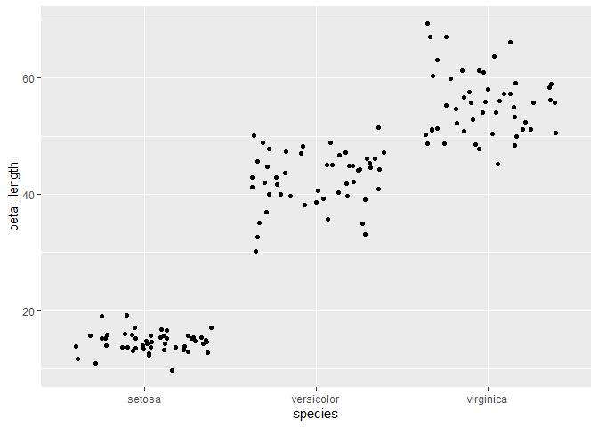
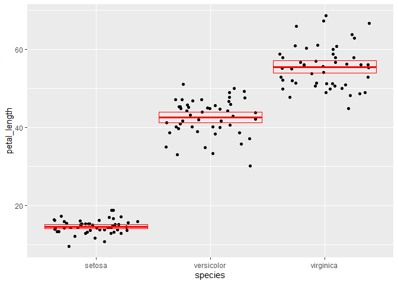
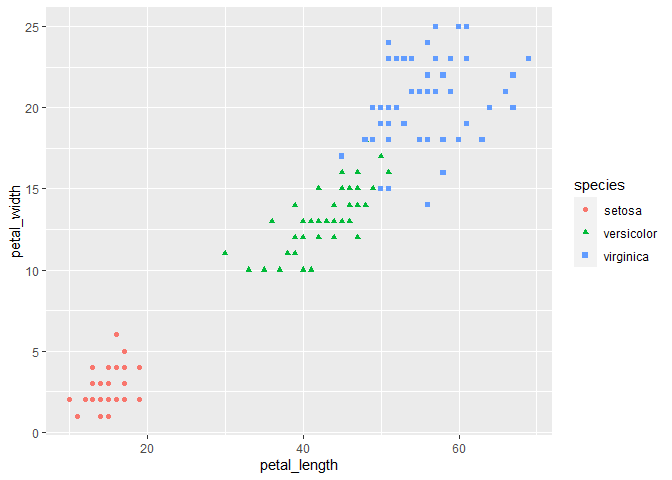

Lab Report 5 and Read Me
================
Faith
2021-02-18

## Welcome

Welcome to my Lab 5 repository and report\! In this lab we worked on
summarizing data in various ways.

## Lab Objectives

  - Rename variables
  - Create new variables
  - Summarize a dataset
  - Summarize a dataset by groups
  - Visualize the relationship between variables
      - Numerical and catagorical variable
      - Two numerical variables
      - Three variables

## Lab Prep

Packages were loaded.

``` r
library(tidyverse)
```

    ## -- Attaching packages --------------------------------------- tidyverse 1.3.0 --

    ## v ggplot2 3.3.2     v purrr   0.3.4
    ## v tibble  3.0.4     v dplyr   1.0.2
    ## v tidyr   1.1.2     v stringr 1.4.0
    ## v readr   1.4.0     v forcats 0.5.0

    ## -- Conflicts ------------------------------------------ tidyverse_conflicts() --
    ## x dplyr::filter() masks stats::filter()
    ## x dplyr::lag()    masks stats::lag()

## Reformat the data

``` r
iris <- as_tibble(iris)
iris
```

    ## # A tibble: 150 x 5
    ##    Sepal.Length Sepal.Width Petal.Length Petal.Width Species
    ##           <dbl>       <dbl>        <dbl>       <dbl> <fct>  
    ##  1          5.1         3.5          1.4         0.2 setosa 
    ##  2          4.9         3            1.4         0.2 setosa 
    ##  3          4.7         3.2          1.3         0.2 setosa 
    ##  4          4.6         3.1          1.5         0.2 setosa 
    ##  5          5           3.6          1.4         0.2 setosa 
    ##  6          5.4         3.9          1.7         0.4 setosa 
    ##  7          4.6         3.4          1.4         0.3 setosa 
    ##  8          5           3.4          1.5         0.2 setosa 
    ##  9          4.4         2.9          1.4         0.2 setosa 
    ## 10          4.9         3.1          1.5         0.1 setosa 
    ## # ... with 140 more rows

## Assignment Questions

1.  Rename each variable so that it is all lower-case and uses an
    underscore \_ instead of a period . in the name (the recommended
    coding style in the tidyverse style guide). Print the resulting
    table.

<!-- end list -->

``` r
new_titles <- rename(iris,
       sepal_length = Sepal.Length,
       sepal_width = Sepal.Width,
       petal_length = Petal.Length,
       petal_width = Petal.Width,
       species = Species
       )

new_titles
```

    ## # A tibble: 150 x 5
    ##    sepal_length sepal_width petal_length petal_width species
    ##           <dbl>       <dbl>        <dbl>       <dbl> <fct>  
    ##  1          5.1         3.5          1.4         0.2 setosa 
    ##  2          4.9         3            1.4         0.2 setosa 
    ##  3          4.7         3.2          1.3         0.2 setosa 
    ##  4          4.6         3.1          1.5         0.2 setosa 
    ##  5          5           3.6          1.4         0.2 setosa 
    ##  6          5.4         3.9          1.7         0.4 setosa 
    ##  7          4.6         3.4          1.4         0.3 setosa 
    ##  8          5           3.4          1.5         0.2 setosa 
    ##  9          4.4         2.9          1.4         0.2 setosa 
    ## 10          4.9         3.1          1.5         0.1 setosa 
    ## # ... with 140 more rows

2.  Convert the four numerical variables from cm to mm by multiplying by
    10. Print the resulting table.

<!-- end list -->

``` r
mm <- mutate(new_titles, sepal_length = sepal_length * 10,
       sepal_width = sepal_width * 10,
       petal_length = petal_length * 10,
       petal_width = petal_width * 10,
       )

mm
```

    ## # A tibble: 150 x 5
    ##    sepal_length sepal_width petal_length petal_width species
    ##           <dbl>       <dbl>        <dbl>       <dbl> <fct>  
    ##  1           51          35           14           2 setosa 
    ##  2           49          30           14           2 setosa 
    ##  3           47          32           13           2 setosa 
    ##  4           46          31           15           2 setosa 
    ##  5           50          36           14           2 setosa 
    ##  6           54          39           17           4 setosa 
    ##  7           46          34           14           3 setosa 
    ##  8           50          34           15           2 setosa 
    ##  9           44          29           14           2 setosa 
    ## 10           49          31           15           1 setosa 
    ## # ... with 140 more rows

3.  Calculate sepal area and petal area (area is equal to length
    multiplied by width). Print a table with only the variables sepal
    area, petal area, and species.

<!-- end list -->

``` r
area <- mutate(mm, sepal_area = sepal_length * sepal_width,
       petal_area = petal_length * petal_width
       )

species_area <- select(area, sepal_area, petal_area, species)

species_area
```

    ## # A tibble: 150 x 3
    ##    sepal_area petal_area species
    ##         <dbl>      <dbl> <fct>  
    ##  1       1785         28 setosa 
    ##  2       1470         28 setosa 
    ##  3       1504         26 setosa 
    ##  4       1426         30 setosa 
    ##  5       1800         28 setosa 
    ##  6       2106         68 setosa 
    ##  7       1564         42 setosa 
    ##  8       1700         30 setosa 
    ##  9       1276         28 setosa 
    ## 10       1519         15 setosa 
    ## # ... with 140 more rows

4.  Calculate the following statistics for the entire dataset from the
    sepal length variable and print the resulting table:

sample size maximum value minimum value range median first quartile (q1)
third quartile (q2) inter-quartile range (iqr)

``` r
sepal_summary <- summarize(mm, sampl_size = n(),
        max = max(sepal_length),
        min = min(sepal_length),
        range = max - min,
        median = median(sepal_length),
        q1 = quantile(sepal_length, .25),
        q3 = quantile(sepal_length, .75),
        IQR = IQR(sepal_length)
)

sepal_summary
```

    ## # A tibble: 1 x 8
    ##   sampl_size   max   min range median    q1    q3   IQR
    ##        <int> <dbl> <dbl> <dbl>  <dbl> <dbl> <dbl> <dbl>
    ## 1        150    79    43    36     58    51    64    13

5.  Calculate the following statistics for each species from the petal
    width variable and print the resulting table:

sample size mean standard deviation variance standard error of the mean
approximate 95% confidence interval

``` r
species <- group_by(mm, species)

species
```

    ## # A tibble: 150 x 5
    ## # Groups:   species [3]
    ##    sepal_length sepal_width petal_length petal_width species
    ##           <dbl>       <dbl>        <dbl>       <dbl> <fct>  
    ##  1           51          35           14           2 setosa 
    ##  2           49          30           14           2 setosa 
    ##  3           47          32           13           2 setosa 
    ##  4           46          31           15           2 setosa 
    ##  5           50          36           14           2 setosa 
    ##  6           54          39           17           4 setosa 
    ##  7           46          34           14           3 setosa 
    ##  8           50          34           15           2 setosa 
    ##  9           44          29           14           2 setosa 
    ## 10           49          31           15           1 setosa 
    ## # ... with 140 more rows

``` r
new <- summarize(species, sampl_size = n(),
          mean = mean(petal_length),
          sd = sd(petal_length),
          var = var(petal_length),
          se = sd / sqrt(sampl_size),
          UCL = mean + (2*se),
          LCL = mean - (2*se)
)
```

    ## `summarise()` ungrouping output (override with `.groups` argument)

``` r
new
```

    ## # A tibble: 3 x 8
    ##   species    sampl_size  mean    sd   var    se   UCL   LCL
    ##   <fct>           <int> <dbl> <dbl> <dbl> <dbl> <dbl> <dbl>
    ## 1 setosa             50  14.6  1.74  3.02 0.246  15.1  14.1
    ## 2 versicolor         50  42.6  4.70 22.1  0.665  43.9  41.3
    ## 3 virginica          50  55.5  5.52 30.5  0.780  57.1  54.0

6.  Visualize the relationship between petal length and species using a
    strip plot.

<!-- end list -->

``` r
ggplot(data = species) +
        geom_jitter(mapping = aes(x = species, y = petal_length))
```

<!-- -->

7.  Starting with the previous graph, add the mean and 95% confidence
    interval for each species.

<!-- end list -->

``` r
ggplot(data = species) +
        geom_jitter(mapping = aes(x = species, y = petal_length)) +
        geom_crossbar(
                data = new, 
                mapping = aes(x = species, y = mean, ymax = UCL, ymin = LCL),
                color = "red"
        )
```

<!-- -->

8.  Visualize the relationship between petal length, petal width, and
    species using a scatterplot. Map the two numerical variables to the
    x and y axes and map species to the color and shape aesthetics.

<!-- end list -->

``` r
ggplot(data = species) +
        geom_point(mapping = aes(x = petal_length, y = petal_width, color = species, shape = species))
```

<!-- -->

## Session Info

Here is my Session information:

``` r
sessioninfo::session_info()
```

    ## - Session info ---------------------------------------------------------------
    ##  setting  value                       
    ##  version  R version 4.0.3 (2020-10-10)
    ##  os       Windows 10 x64              
    ##  system   x86_64, mingw32             
    ##  ui       RTerm                       
    ##  language (EN)                        
    ##  collate  English_United States.1252  
    ##  ctype    English_United States.1252  
    ##  tz       America/Chicago             
    ##  date     2021-02-18                  
    ## 
    ## - Packages -------------------------------------------------------------------
    ##  package     * version date       lib source        
    ##  assertthat    0.2.1   2019-03-21 [1] CRAN (R 4.0.3)
    ##  backports     1.1.10  2020-09-15 [1] CRAN (R 4.0.3)
    ##  broom         0.7.2   2020-10-20 [1] CRAN (R 4.0.3)
    ##  cellranger    1.1.0   2016-07-27 [1] CRAN (R 4.0.3)
    ##  cli           2.1.0   2020-10-12 [1] CRAN (R 4.0.3)
    ##  colorspace    1.4-1   2019-03-18 [1] CRAN (R 4.0.3)
    ##  crayon        1.3.4   2017-09-16 [1] CRAN (R 4.0.3)
    ##  DBI           1.1.0   2019-12-15 [1] CRAN (R 4.0.3)
    ##  dbplyr        2.0.0   2020-11-03 [1] CRAN (R 4.0.3)
    ##  digest        0.6.27  2020-10-24 [1] CRAN (R 4.0.3)
    ##  dplyr       * 1.0.2   2020-08-18 [1] CRAN (R 4.0.3)
    ##  ellipsis      0.3.1   2020-05-15 [1] CRAN (R 4.0.3)
    ##  evaluate      0.14    2019-05-28 [1] CRAN (R 4.0.3)
    ##  fansi         0.4.1   2020-01-08 [1] CRAN (R 4.0.3)
    ##  farver        2.0.3   2020-01-16 [1] CRAN (R 4.0.3)
    ##  forcats     * 0.5.0   2020-03-01 [1] CRAN (R 4.0.3)
    ##  fs            1.5.0   2020-07-31 [1] CRAN (R 4.0.3)
    ##  generics      0.1.0   2020-10-31 [1] CRAN (R 4.0.3)
    ##  ggplot2     * 3.3.2   2020-06-19 [1] CRAN (R 4.0.3)
    ##  glue          1.4.2   2020-08-27 [1] CRAN (R 4.0.3)
    ##  gtable        0.3.0   2019-03-25 [1] CRAN (R 4.0.3)
    ##  haven         2.3.1   2020-06-01 [1] CRAN (R 4.0.3)
    ##  hms           0.5.3   2020-01-08 [1] CRAN (R 4.0.3)
    ##  htmltools     0.5.0   2020-06-16 [1] CRAN (R 4.0.3)
    ##  httr          1.4.2   2020-07-20 [1] CRAN (R 4.0.3)
    ##  jsonlite      1.7.1   2020-09-07 [1] CRAN (R 4.0.3)
    ##  knitr         1.30    2020-09-22 [1] CRAN (R 4.0.3)
    ##  labeling      0.4.2   2020-10-20 [1] CRAN (R 4.0.3)
    ##  lifecycle     0.2.0   2020-03-06 [1] CRAN (R 4.0.3)
    ##  lubridate     1.7.9   2020-06-08 [1] CRAN (R 4.0.3)
    ##  magrittr      1.5     2014-11-22 [1] CRAN (R 4.0.3)
    ##  modelr        0.1.8   2020-05-19 [1] CRAN (R 4.0.3)
    ##  munsell       0.5.0   2018-06-12 [1] CRAN (R 4.0.3)
    ##  pillar        1.4.6   2020-07-10 [1] CRAN (R 4.0.3)
    ##  pkgconfig     2.0.3   2019-09-22 [1] CRAN (R 4.0.3)
    ##  purrr       * 0.3.4   2020-04-17 [1] CRAN (R 4.0.3)
    ##  R6            2.5.0   2020-10-28 [1] CRAN (R 4.0.3)
    ##  Rcpp          1.0.5   2020-07-06 [1] CRAN (R 4.0.3)
    ##  readr       * 1.4.0   2020-10-05 [1] CRAN (R 4.0.3)
    ##  readxl        1.3.1   2019-03-13 [1] CRAN (R 4.0.3)
    ##  reprex        0.3.0   2019-05-16 [1] CRAN (R 4.0.3)
    ##  rlang         0.4.8   2020-10-08 [1] CRAN (R 4.0.3)
    ##  rmarkdown     2.5     2020-10-21 [1] CRAN (R 4.0.3)
    ##  rstudioapi    0.11    2020-02-07 [1] CRAN (R 4.0.3)
    ##  rvest         0.3.6   2020-07-25 [1] CRAN (R 4.0.3)
    ##  scales        1.1.1   2020-05-11 [1] CRAN (R 4.0.3)
    ##  sessioninfo   1.1.1   2018-11-05 [1] CRAN (R 4.0.3)
    ##  stringi       1.5.3   2020-09-09 [1] CRAN (R 4.0.3)
    ##  stringr     * 1.4.0   2019-02-10 [1] CRAN (R 4.0.3)
    ##  tibble      * 3.0.4   2020-10-12 [1] CRAN (R 4.0.3)
    ##  tidyr       * 1.1.2   2020-08-27 [1] CRAN (R 4.0.3)
    ##  tidyselect    1.1.0   2020-05-11 [1] CRAN (R 4.0.3)
    ##  tidyverse   * 1.3.0   2019-11-21 [1] CRAN (R 4.0.3)
    ##  utf8          1.1.4   2018-05-24 [1] CRAN (R 4.0.3)
    ##  vctrs         0.3.4   2020-08-29 [1] CRAN (R 4.0.3)
    ##  withr         2.3.0   2020-09-22 [1] CRAN (R 4.0.3)
    ##  xfun          0.19    2020-10-30 [1] CRAN (R 4.0.3)
    ##  xml2          1.3.2   2020-04-23 [1] CRAN (R 4.0.3)
    ##  yaml          2.2.1   2020-02-01 [1] CRAN (R 4.0.3)
    ## 
    ## [1] C:/Users/markr/OneDrive/Documents/R/win-library/4.0
    ## [2] C:/Program Files/R/R-4.0.3/library
